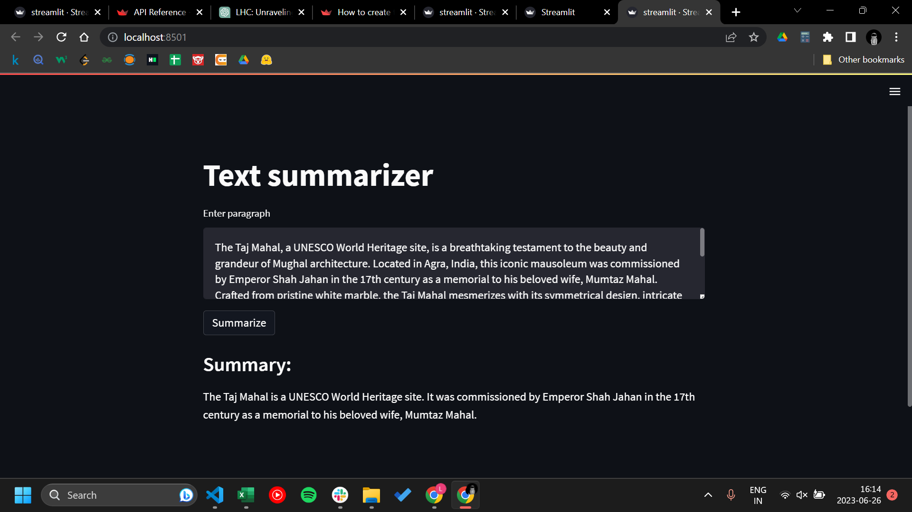

# Text-summarizer
End to end text summarizer

data source : [source](https://huggingface.co/datasets/samsum)

hugging face model: [source](https://huggingface.co/google/pegasus-cnn_dailymail)

### Workflows:
- Update config.yaml
- Update params.yaml
- Update entity
- Update the configuration manager in src config
- Update the components
- Update the pipeline
- Update the main.py
- Update the app.py

## Screenshot of the webapp

# To run offline:
This can also be run offline. To do so, follow the steps below:

#### Clone the repo

`git clone 'https://github.com/LoyumM/Text-summarizer.git'`

#### Create a virtual environment

`conda create --p venv python=3.8 -y`

#### Activate environment

`conda activate venv/`

#### Install the required modules

`pip install -r requirements.txt`

#### Run the application

`streamlit run streamlit.py`
